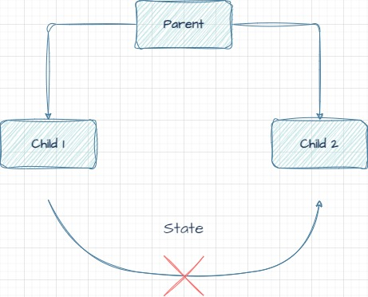
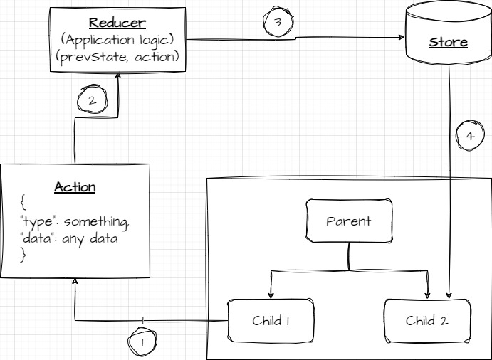

## Preface

In this two part blog we are going to see what redux is and why, when and how we should use it in our react projects (Please feel free to reachout to me if you feel any part of this blog is wrong).

## Introduction

Redux is a state management library. In common man's terms it is used to keep states **"global"** so that it can be easily used by other components.

> A **state**  is way for React to keep track of what should be shown in the UI and when to change them. Every component has its own state and can get some states from its parent using **props**

## Why 🤔

One of the major pain points for react developers is trying to pass some data between two/more unconnected components. React has a Parent-Child data passing model. This is good for most cases but when you need to pass data between two sibling components, its not possible unless we lift the state to their common parent.

*Sharing state between react siblings*

## When 🕛

For usecases like this where we need to store a lot of **"global"** state information, redux is a really good approach. Before we conclude redux as the ultimate solution to all our problems, let first review how redux works.

> One thing to remember is an app can have only one Redux store

## Redux ⚛️

Here is an illustration to show how redux works

*Redux illustration*

1. When some changes happens in the UI's state for eg. a button click, options select etc, the component **dispatches** an **action**.
2. The **action** constains two pieces of important information, type and data. The type is used to set the type of actions we want to perform in the store, eg DELETE_TODO, ADD_TODO etc. The type is user defined and can be anything based on the component.
3. The **reducer** is where we process the action with respect to the previous state and the action dispached from the component. Here we define the business logic as to how the state should change and store the new state in app's store. This reducer function has to be a **pure function**.
4. When the state changes in the redux store, it is automatically sent to all the components that have subscribed to this state.

> *pure functions* are function which return the same value for same arguments. They dont change any value defined outside the definition.

So this is the fundamentals of redux, in the next part we will see the React implementation of these concepts.
Until then cheers!! 🙌
